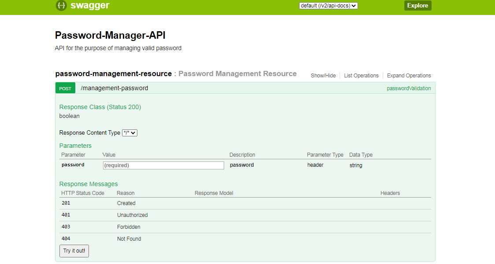

[](https://travis-ci.org/Relesi/cucumber-java)

# Password-Manager-API       

**Manager-API Specification** (formerly Swagger Specification) is an API description format for REST APIs. An OpenAPI file allows you to describe your entire API, including:

* Available endpoints (```/management-password```) and operations on each endpoint ( ```POST /management-password```)
* Operation parameters Input and output for each operation
* Authentication methods

	
* The Password-Manager-API has to perform password validations according to its criteria, returning TRUE when it is valid and FALSE when it is invalid.

* Configure the parameters to be Headers
* No KEY fields use the following parameter: password
* No Value fields pass a String. Example: Rls2801973!
* Check the result in Postman, if your password is valid, an API will return a Boolean TRUE, if a password is not valid, an API will return a Boolean FALSE

* Responses
For each operation, you can define possible status codes, such as 200 OK, 404 Not Found or "status": 400,
    "error": "Bad Request", and schema of the response body. Schemas can be defined inline or referenced from an external definition via $ref. You can also provide example responses for different content types.
 
### Dependencies 

* Java 11
* Maven 2.4.11
* Spring Framework Versão (2.4.2) 
* jUnit 5 (org.junit.jupiter.api, org.junit.jupiter.engine and org.junit.jupiter.params - 5.4.0)
* Log4j (1.2.17)
* Jacoco (0.7.9)
* Swagger(2.7.0)


### Travis-CI

	Utilizo o travis-ci para integração continua.
	
	* https://travis-ci.org/


## Introduction to OpenAPI Specification

### **Basic Structure**
Swagger can be written in JSON or YAML. In this guide, we only use YAML examples, but JSON works equally well. A sample Swagger specification written in YAML looks like:

```yaml
swagger: '2.0'
info:
  description: API for the purpose of managing valid password
  version: '1.0'
  title: Password-Manager-API
host: '127.0.0.1:8080'
basePath: /
tags:
  - name: password-management-resource
    description: Password Management Resource
paths:
  /management-password:
    post:
      tags:
        - password-management-resource
      summary: passwordValidation
      operationId: passwordValidationUsingPOST
      consumes:
        - application/json
      produces:
        - '*/*'
      parameters:
        - name: password
          in: header
          description: password
          required: true
          type: string
      responses:
        '200':
          description: OK
          schema:
            type: boolean
        '201':
          description: Created
        '401':
          description: Unauthorized
        '403':
          description: Forbidden
        '404':
          description: Not Found
```

### Swagger-ui

* swagger-ui: `http://127.0.0.1:8080/swagger-ui.html`




### Swagger-io

* swagger.json: `http://127.0.0.1:8080/v2/api-docs`


### How to run the service

*Make sure you have Maven installed and added to your operating system's PATH, as well as Git.
	
*cd /path/to/your/repo
*mvn spring-boot:run


### Importing the project into Eclipse STS, Eclipse or Intellij

	
*mvn eclipse:eclipse
	
*In STS/Eclipse import the project as project  Maven.
*After the project is imported, change the application to test and run the following commands.
*mvn clean install
*mvn install 
*maven - update project


